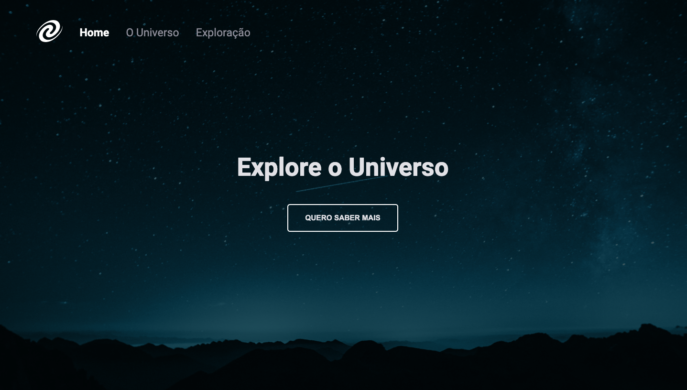

<h1 align="center">
  SPA Universe 🌌
</h1>

  <a href="#-tecnologias">Tecnologias</a>&nbsp;&nbsp;&nbsp;|&nbsp;&nbsp;&nbsp;
  <a href="#-projeto">Projeto</a>&nbsp;&nbsp;&nbsp;|&nbsp;&nbsp;&nbsp;
  <a href="#-projeto">Projeto</a>&nbsp;&nbsp;&nbsp;|&nbsp;&nbsp;&nbsp;
  <a href="#-instalação-e-execução">Instalação e execução</a>&nbsp;&nbsp;&nbsp;|&nbsp;&nbsp;&nbsp;
  <a href="#-layout">Layout</a>&nbsp;&nbsp;&nbsp;|&nbsp;&nbsp;&nbsp;
  <a href="#memo-licença">Licença</a>

  

## 🚀 Tecnologias

Esse projeto foi desenvolvido com as seguintes tecnologias:

- HTML
- CSS
- JavaScript
- Node.js

## 💻 Projeto

Aplicação desenvolvida utilizando conceitos de SPA (Single Page Application).

## 🚀 Instalação e execução

1. Abra o terminal do seu computador. 
3. Faça um clone desse repositório rodando:   `git clone https://github.com/AlanRehfeldt/ExplorerStage06-SPA_Universe`;
4. Entre na pasta rodando pelo terminal: `cd ExplorerStage06-SPA_Universe`;
5. Rode `npm i` para instalar as dependências do projeto;
6. Rode `npm start` para iniciar o servidor de desenvolvimento.

## 🔗 Link
[Acesse aqui](https://alanrehfeldt.github.io/ExplorerStage06-SPA_Universe/)

## 🔖 Layout

Você pode visualizar o layout do projeto através [desse link](https://www.figma.com/file/dzL37jx71VTFI0NvgW0Wk1/%5BDesafios-Explorer%5D-SPA-Universe-(Copy)). É necessário ter conta no [Figma](https://figma.com) para acessá-lo.

## :memo: Licença

Esse projeto está sob a licença MIT. Veja o arquivo [LICENSE](LICENSE.md) para mais detalhes.

---

Feito por Alan Rehfeldt :wave: 
